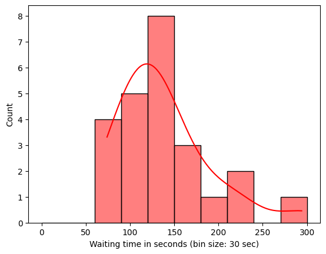
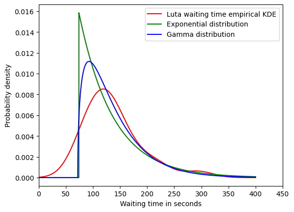
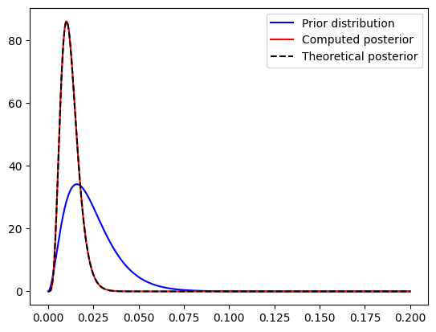
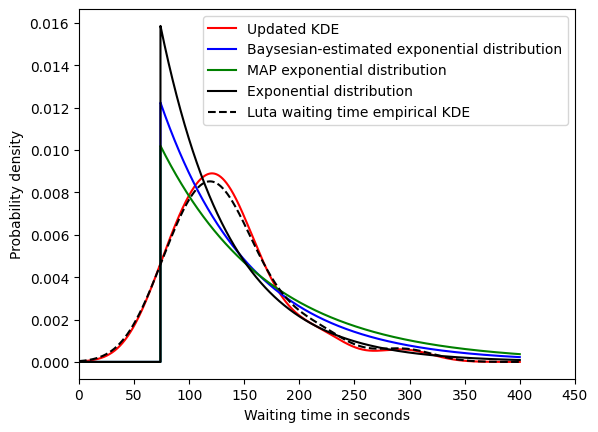

# Luta waiting time analysis

In this repo, I analyze double espresso waiting time at Luta, the best coffee shop in the world. I also provide a Bayesian framework for Luta fans to update their waiting time and improve the waiting time model.

## Data

I have record the waiting time for the Ethopia double espresso during 08:30 - 09:15 at Luta for 24 weekdays. Data is [here](https://github.com/danicychao/Luta_waiting_time_hypothesis/blob/main/data_waiting_time.txt).

## Probability distribution of waiting time

- The minimum of the 24 data points is 74 seconds, which is very likely the least required time for Luta boys to serve the double espresso (taking order, grinding, machine extracting, and handing to customer).

- The average of the 24 data points is ~137 seconds, with deviation ~52 seconds.

- Since both (shifted) exponential distribution and gamma distribution fit the 24 data points reasonably well, it is hard to decide which distribution works better on the Luta waiting time.

- Although gamma distribution might fit slightly better, exponential distribution is simpler and has only one parameter. Threfore, I use exponential distribution for the Bayesian framework.

Fitting result:

## Bayesian framework

- Since gamma distribution is the conjugate prior for exponential distribution, I use gamma distribution as the prior in this Bayesian framework for Luta waiting time analysis. This not only ensures the posterior is also a gamma distribution, but also makes the computation of posterior much easier.

- The prior belief is built on my observation. The initial parameters of gamma prior are chosen so its ***mode*** equals to the ***mean*** of the fitted exponential distribution above.
  
- While one can exploit the conjugate property and easily get the parameters of the gamma posterior, the posterior mean, and Maximum a posteriori (MAP) easily without calculating the likelohood, I also provide the code snippet to manually compute the likelihood. Even if the prior is not the conjugate prior, one can still use the codes in the snippet to calculate likelohood, posterior distribution, posterior mean, and MAP.

- Taking 87, 147, and 130 seconds as the examples of newly observed data, the gamma posterior becomes narrower than the gamma prior - the newly observed waiting times make the prior belief of gamma distribution more informative.

- With the same examples, the 95% Bayesian credible region of (average) waiting time is between 116 and 297 seconds, which is narrower than the 95% frequentist confidence interval ([75.60, 306.55]). This reflects that the choice of prior, gamma distribution with parameters pre-decided by the 24 observed waiting times, is not only informative but also aligned with the observed data.

Posterior and prior:

Bayesian estimated waiting time distribution:

- One can further update the prior belief with the posterior of their observed waiting times by uncommenting the code snippet in the end.  

## Prospects

- [ ] Create a frontend to collect data from other Luta fans
- [ ] After the frontend is created and enough data is collected, build a regression model to predict waiting time based on item, time, and day.

On a weekday morning, please feel lucky and grateful if you get your Ethopia double espresso less than 74 seconds after you order. Also please be patient if you wait for the double espresso for more than 200 seconds - there are probably longer queues with fancy orders (e.g. matcha latte). Believe me, Luta boys do not like that either ; )

